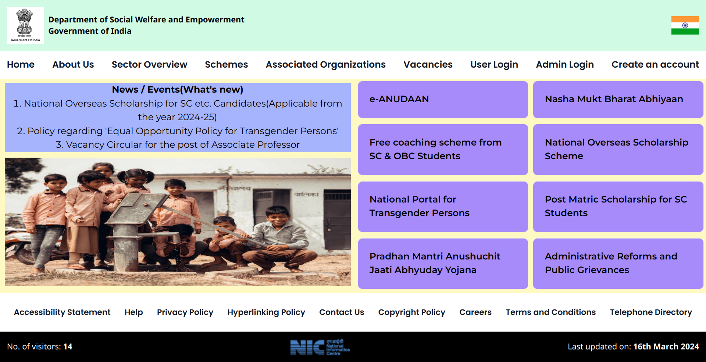
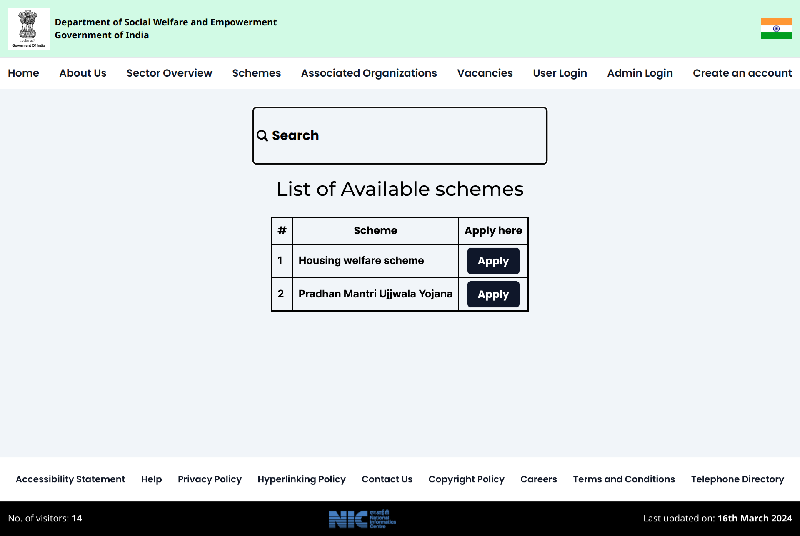

Site is live [here](https://gov-welfare-schemes.vercel.app/)

### Government Schemes Awareness
This is a full stack website built using the **MERN** stack.
The styling library used is Tailwind CSS.
Website hasn't been deployed yet.

The website has user and admin functionality. The user can apply to schemes post approval of their account by the admin. The admin also has the ability to 
add more schemes and also oversees the approval/rejection of schemes.

